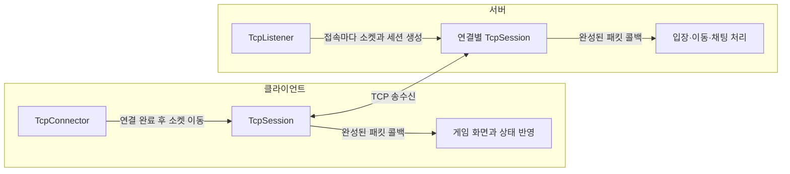

# TCP 기반 멀티플레이 데모 · Maple Chat

여러 클라이언트가 같은 공간에서 이동·점프하고 채팅을 주고받는 개인 프로젝트입니다. Winsock2와 단일 스레드 `select`로 논블로킹 TCP 서버와 클라이언트를 구현했습니다.

클라이언트 개발자로서 접속, 데이터 송수신, 상태 공유가 어떻게 이어지는지 이해하기 위해 제작했습니다. 화면과 게임 오브젝트는 [HiFi-Rush 모작에서 제작한 자체 엔진](https://github.com/HGM2695/HiFi-Rush)을 SDK로 재사용하고, 이번 프로젝트에서는 통신과 멀티플레이 로직을 구현했습니다.

[](https://www.youtube.com/watch?v=WVncVzkTY3Q)

**[▶ 시연 영상](https://www.youtube.com/watch?v=WVncVzkTY3Q)**

| 구분 | 내용 |
| --- | --- |
| 개발 형태 | 개인 프로젝트 · 서버 및 클라이언트 구현 |
| 주요 기술 | C++20, Winsock2, TCP, select |
| 엔진 | 자체 제작 GMEngine SDK · DirectX 11 |
| 구현 범위 | 플레이어 입장·퇴장, 서버 권위 기반 이동·점프 및 동작 상태 동기화, 채팅 |

## 연결마다 송수신 상태를 관리하는 구조

접속을 처리하는 코드와 접속 이후의 통신 코드를 나눴습니다. 클라이언트의 `TcpConnector`는 연결이 완료된 소켓을 `TcpSession`으로 이동하고, 서버의 `TcpListener`는 접속을 수락할 때마다 연결별 세션을 생성합니다.

`TcpSession`은 소켓, 수신 버퍼, 송신 버퍼를 함께 관리합니다. 소켓은 복사를 막고 이동만 허용했으며, 소유 객체가 소멸할 때 `closesocket`을 호출하도록 했습니다. 연결이 종료되면 세션을 제거하고 게임 코드에 종료 사실을 전달합니다.



통신 계층은 패킷을 복원해 콜백으로 전달하고, 게임 계층은 패킷 ID에 따라 내용을 해석합니다. 이를 통해 `NetworkCore`에서 캐릭터나 채팅 UI를 알 필요 없이 클라이언트와 서버가 같은 송수신 코드를 사용하도록 했습니다.

| 프로젝트 | 담당 역할 |
| --- | --- |
| [NetworkCore](NetworkCore) | 소켓 수명, 비동기 연결 진행 확인, 세션, 송수신 버퍼, 패킷 복원 |
| [GameProtocol](GameProtocol) | 패킷 ID, 플레이어 ID, 이동·입장·채팅 데이터 형식 |
| [GameServer](GameServer) | 플레이어 관리, 이동·점프 시뮬레이션, 상태 및 채팅 전달 |
| [GameClient](GameClient) | 접속 UI, 입력 전송, 캐릭터·애니메이션·말풍선 표시 |

## TCP 데이터를 게임 패킷으로 복원한 방법

TCP에서는 한 번 보낸 데이터가 여러 번에 나뉘어 수신되거나, 여러 번 보낸 데이터가 한꺼번에 수신될 수 있습니다. 따라서 `recv` 한 번을 게임 패킷 하나로 취급하지 않고, 수신 데이터를 버퍼에 누적한 뒤 길이를 기준으로 꺼내도록 했습니다.

패킷은 다음 형식으로 구성했습니다. `packetSize`는 헤더를 포함한 전체 길이입니다.

```text
[ packetSize: 2바이트 ][ packetId: 2바이트 ][ payload: 가변 길이 ]
```

1. 헤더 4바이트가 모이면 전체 패킷 길이를 읽습니다.
2. 길이가 헤더보다 작거나 최대 패킷 크기인 16KB를 넘으면 유효하지 않은 패킷으로 처리합니다.
3. 본문이 아직 덜 도착했다면 버퍼에 남겨 다음 수신을 기다립니다.
4. 패킷 전체가 모였을 때만 콜백에 전달하고, 버퍼에 다음 패킷이 있으면 이어서 처리합니다.

송신도 요청한 데이터를 한 번에 모두 보낸다고 가정하지 않았습니다. 보낼 패킷을 송신 버퍼에 쌓고, `send`가 반환한 바이트 수만큼만 소비합니다. 나머지는 버퍼에 유지하고 다음 송신 가능 시점에 이어 보냅니다. `WSAEWOULDBLOCK`도 연결 실패로 처리하지 않고 다음 기회를 기다립니다.

`select`에는 읽을 소켓과 보낼 데이터가 남은 소켓을 등록합니다. 준비된 소켓의 I/O만 시도해, 단일 루프에서 연결별 통신을 진행하도록 구성했습니다.

관련 코드: [TcpSession.cpp](NetworkCore/TcpSession.cpp), [ByteBuffer.cpp](NetworkCore/ByteBuffer.cpp), [TcpSocket.cpp](NetworkCore/TcpSocket.cpp), [TcpServerService.cpp](NetworkCore/TcpServerService.cpp)

## 서버에서 계산한 이동 결과를 공유

클라이언트가 계산한 위치를 그대로 전달하는 대신, 이동 방향과 점프 입력을 서버로 보냅니다. 서버는 입력을 반영해 물리를 시뮬레이션하고, 계산한 위치·동작 상태·바라보는 방향을 클라이언트에 전달합니다. 클라이언트는 받은 결과로 캐릭터 위치와 애니메이션을 갱신합니다.

```text
클라이언트 입력
  → C2S_MoveRequest: 이동 방향, 점프 여부
  → 서버의 이동·물리 계산
  → S2C_PlayerMoved: 위치, 동작 상태, 바라보는 방향
  → 각 클라이언트의 캐릭터와 애니메이션 반영
```

서버 시뮬레이션은 `1/60초` 고정 간격으로 진행합니다. 서버에서도 자체 엔진의 `SceneManager`, 컴포넌트, `PhysicsSystem2D`를 사용해 플레이어와 바닥을 구성했습니다. 클라이언트에서는 이동 방향이 바뀌거나 점프 입력이 있을 때 이동 요청을 보냅니다.

입장 시에는 서버가 플레이어 ID를 발급하고 기존 플레이어 정보를 신규 클라이언트에 전달합니다. 이어서 신규 플레이어 정보를 입장한 클라이언트들에게 알려 각 화면에 캐릭터를 생성합니다. 퇴장 시에는 해당 플레이어 ID를 전달해 캐릭터를 제거합니다. 채팅은 서버가 입장 여부와 메시지 길이를 확인한 뒤, 발신자 ID와 메시지를 전달해 해당 캐릭터의 말풍선에 표시합니다.

관련 코드: [GameServerApplication.cpp](GameServer/GameServerApplication.cpp), [ServerPlayerMovementComponent.cpp](GameServer/ServerPlayerMovementComponent.cpp), [NetworkDemoGameInstance.cpp](GameClient/NetworkDemoGameInstance.cpp), [MainScene.cpp](GameClient/MainScene.cpp)

## 빌드 및 실행

프로젝트 설정 기준으로 **Windows, Visual Studio 2022의 C++ 데스크톱 개발 도구, MSVC v143, Windows SDK 10.0, x64**가 필요합니다. GMEngine SDK는 `Debug | x64`와 `Release | x64` 구성을 지원합니다.

저장소에는 `External/GMEngineSDK`의 헤더·라이브러리·런타임 DLL·셰이더와 `GameClient/Resources`가 포함되어 있습니다. SDK 설정은 [GMEngine.props](External/GMEngineSDK/Build/GMEngine.props)에서 가져오며, 빌드 후 필요한 DLL·셰이더·게임 리소스를 출력 경로에 복사하도록 구성했습니다.

1. `NetworkDemo.sln`을 열고 `Release | x64`로 솔루션을 빌드합니다.
2. `x64/Release`에서 `GameServer.exe`를 먼저 실행합니다. 서버의 기본 포트는 `49900`입니다.
3. 같은 디렉터리에서 `GameClient.exe`를 실행합니다. 여러 번 실행하면 여러 클라이언트로 접속할 수 있습니다.
4. 같은 PC에서 확인할 경우 주소 `127.0.0.1`, 포트 `49900`, 닉네임을 입력합니다.

리소스와 셰이더를 상대 경로로 참조하므로 실행 파일만 따로 옮기지 않고 빌드 출력 구조를 유지합니다. Visual Studio에서는 SDK 속성 시트가 작업 디렉터리를 `$(OutDir)`로 설정합니다.

| 조작 | 입력 |
| --- | --- |
| 이동 | 좌우 방향키 |
| 점프 | 위 방향키 |
| 채팅 | Enter로 입력창 활성화, 메시지 입력 후 Enter |
| 퇴장 | Esc로 퇴장 확인창 열기. 입력창에 포커스가 있으면 먼저 포커스 해제 |

## 확인한 내용과 현재 범위

여러 클라이언트에서 이동과 채팅이 공유되는 동작을 확인했습니다. 분할·연속 수신과 부분 송신은 발생 가능성을 고려해 버퍼에 누적하고 이어 처리하도록 구현했습니다.

현재 패킷은 C++ 구조체의 메모리 배치와 바이트 순서를 그대로 사용하므로 같은 Windows x64 빌드 환경을 전제로 합니다. 클라이언트 예측이나 보간 없이 서버에서 받은 위치를 직접 반영하는 범위까지 구현했습니다.

메이플스토리의 캐릭터·배경·음악 에셋을 활용한 개인 학습용 프로젝트입니다. 해당 에셋의 권리는 원저작권자에게 있습니다.
